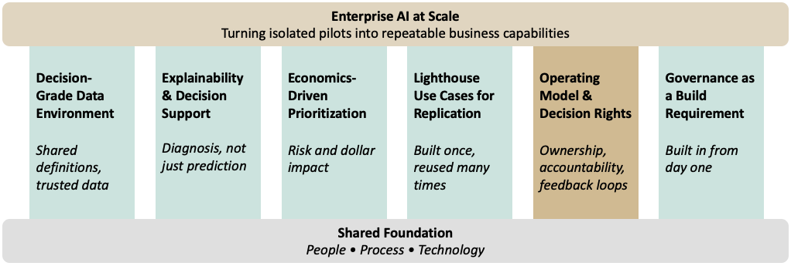

## Introduction

Every bank has an AI pilot that worked. Few have one that scaled.

Here's the usual pattern. A team builds something. It works. Leadership praises it in a steering committee. Then nothing happens — it never gets used again, never gets connected to anything else, and quietly drops off next year's plan. The problem isn't the model. It's everything around the model: the data it needs, how the bank decides what to build next, who owns the decision once the model runs, and — for banks specifically — the governance that lets it survive an exam.

Getting from pilot to production takes six capabilities. Banks that scale build all six at once. Banks that don't pick one or two and hope the rest sort themselves out.

---

## The Capabilities That Actually Scale AI in Banking

Scaling AI requires more than successful use cases. It requires a set of reinforcing capabilities that transform isolated pilots into repeatable enterprise outcomes.

{fig-align="center"}

### A Decision-Grade Data Environment

Most scaling failures start in the same place: the data was good enough for a pilot, but not good enough to run a real decision on. A pilot can get by on a one-time extract, a manual join, an analyst patching together three systems in a spreadsheet. Production can't. It needs transaction data, credit bureau feeds, core banking records, and customer data — all defined the same way across systems, not just stored in the same format.

This is harder than it sounds. Getting to one shared definition usually means untangling years of conflicting logic built up across different teams and systems before a model can run safely on its own. It's tempting to treat this as a cleanup project you do once. It isn't. The data needs ongoing maintenance, just like the models built on top of it — because a model trained on data that's quietly drifting will degrade in ways that are much harder to catch than a model that simply breaks.

---

### Tooling That Explains, Not Just Predicts

A model that flags a problem is useful. A system that explains why the problem exists and what action should be taken is far more valuable. The tools need to do more than detect anomalies or generate scores — they need to support diagnosis by comparing outcomes across customers, products, segments, and time periods to identify the underlying drivers. Production systems should help users move from detection to explanation and, ultimately, to action.

This matters for two different audiences. The business has to act on the output. Risk and the examiners have to understand why the model made that call, under SR 11-7's expectations for ongoing monitoring. If a model can’t support a credible explanation for its outputs, it isn’t ready for production, no matter how accurate it is. Spending tooling budget purely on prediction accuracy misses the point — that's the part the pilot already proved. Explanation is the part production actually needs.

--- 

### Economics-Driven Prioritization

Without a clear way to decide what gets built next, resources go to whoever shouts loudest — and that's exactly what happens when credit risk, fraud, and the front office all compete for the same modeling team. The fix is to prioritize based on actual risk and dollar impact, not on who escalates the hardest.

This means setting up a standing process that scores every proposed use case against the same criteria before it gets greenlit: expected loss reduction, regulatory exposure, how hard it is to build, and whether the data is already in shape to support it. It's not exciting work. But it's the difference between an analytics team that looks like it's always reacting to the loudest complaint, and one that looks like it knows what it's doing.

---

### Lighthouse Use Cases Built for Replication

The natural instinct in a large organization is to spread AI investment around — a pilot for every department, so everyone feels included. That's backwards. Real scale comes from picking a small number of use cases and building them well, with an eye toward reuse: the data, the model components, and the governance work from the first use case should make the fifth one faster to build, not just the first one successful.

Take a next-best-product model. Its value isn't just the revenue it generates. Built right, the decision logic, the data documentation, and the governance work behind it become a template the next model can build on instead of starting from scratch. Banks that treat every new use case as a one-off never get past pilots — they're paying to rebuild the same foundation every time.

---

### Operating Model and Decision Rights

This is where most scaling efforts actually die. Not in the modeling — in the confusion over who owns the decision once the model produces an output. A model that's just a recommendation someone can ignore is a demo. A model that's built into the workflow, with someone clearly accountable for acting on it, is a capability. Most analytics teams get stuck right here: the output sits there, technically available, but nobody was ever told it was their job to use it.

Banking has one more wrinkle most industries don't. The operating model has to satisfy not just the business, but model risk governance and, eventually, examiners. That means tracking more than adoption and lift — it means tracking whether the model is still performing the way it was validated to perform. A model that can't show that will get flagged, no matter how well it scaled operationally.

Scaled AI programs also create feedback loops. Model outputs, business outcomes, overrides, and exceptions should be captured and fed back into both the data environment and the operating model. Without that loop, organizations automate decisions but fail to improve them. The goal is not simply to deploy models, but to create a system that continuously learns from its own results.

---

### Governance as a Build Requirement, Not an Afterthought

The first five capabilities apply to any industry. This one is specific to banks, and it changes how the other five get built — not just whether someone checks them afterward.

Recent regulatory guidance recognizes that generative and agentic AI systems do not fit neatly within traditional model risk management frameworks. Existing controls remain important, but they do not fully address emerging risks such as prompt injection, autonomous decision-making, tool use, and multi-agent interactions. Rather than waiting for prescriptive requirements, banks can use this period to build governance capabilities that are proportional to the risks these systems create.

This means the data work behind a decision-grade data environment tracks where data comes from and who touched it, from the start. It means the explainability tooling produces documentation good enough for a validation review, not just a dashboard. It means the operating model assigns a named owner for the data, the model, and the decision — because that's exactly where AI systems create risk that older model risk frameworks were never built to catch.

Banks stuck running permanent pilots usually treated governance as the last step. Banks that scale treat it as the foundation the other five capabilities sit on, from day one.

---

## The Sequencing Question

None of this means redesigning the whole bank before the first use case ships. It means building all six capabilities together, at whatever scale the first use case needs, instead of adding them one at a time as gaps show up. Skip that, and you pay for it later — a use case picked without real prioritization behind it is just a guess that happened to work.

Pick one good use case. Build the data, the explainability tooling, and the governance around it properly — not the minimum to ship, but a version meant to be reused. Let that foundation carry into the next use case. Each one should be cheaper and faster to build than the last, because it's drawing on infrastructure that already exists. If the second use case costs about the same as the first, the first one wasn't built to scale.

---

## Beyond the Pilot: Preparing for Generative and Agentic AI

The six capabilities described here become increasingly important as institutions move beyond traditional predictive models toward generative and agentic AI. A reporting dashboard can tolerate fragmented ownership and manual processes. An autonomous system cannot. As AI systems gain the ability to generate content, recommend actions, and eventually execute workflows, weaknesses in data quality, governance, decision rights, and accountability become far more consequential.

This is a recurring theme across my work on AI strategy, governance, and agentic systems. Whether the objective is deploying a predictive model, implementing a knowledge assistant, or orchestrating a network of AI agents, the same organizational foundations remain necessary. The technologies change. The operating principles do not.

Institutions often view data foundations, explainability, governance, and operating models as separate initiatives. In reallity, they are different aspects of the same problem: creating an environment where AI can be trusted to influence decisions at scale. The organizations that solve this problem will be better positioned not only to deploy today’s AI capabilities, but also to adopt the more autonomous systems that are rapidly emerging.

---

## Conclusion

The banks that get AI to scale aren't the ones with the best model. They're the ones that built all six capabilities together, instead of treating five of them as someone else's problem. Data, tooling, prioritization, replicable use cases, clear ownership, and governance — skip any one of them, and the next use case starts from zero again.

That's the real difference between a pilot and a capability. A pilot proves the idea works. A capability means the next ten ideas get easier, not harder.
