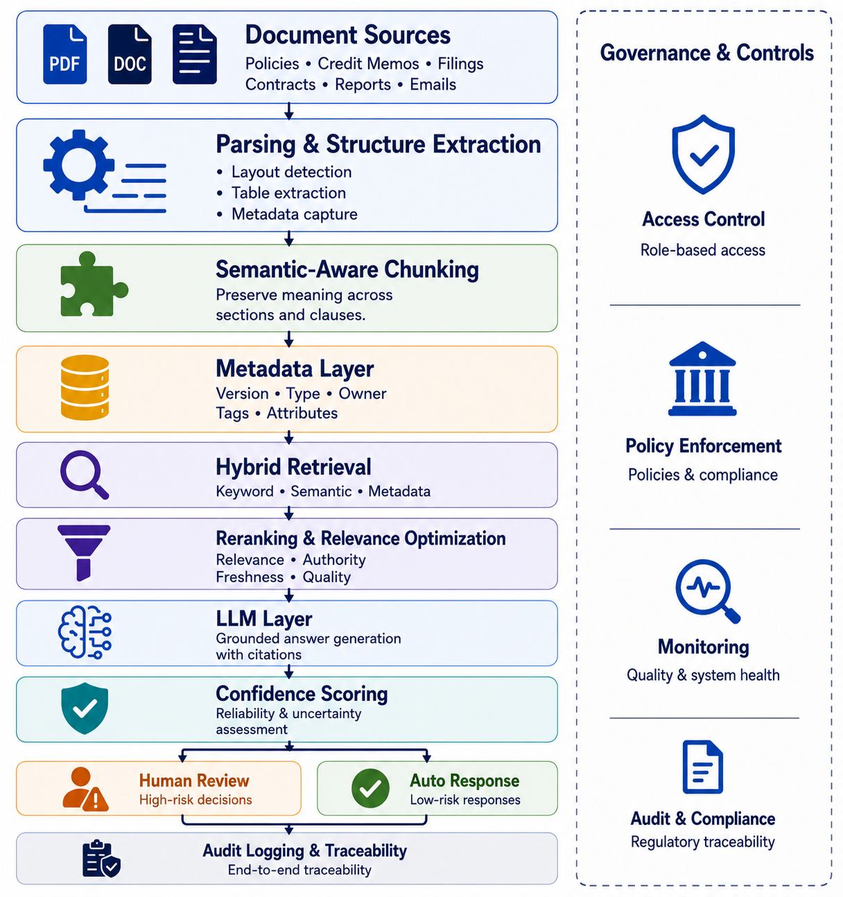

## Introduction: The Demo Gap

The demo always works. A vendor queries loan agreements, credit memos, regulatory filings — answers appear, sources are cited, executives are impressed. A pilot gets approved.

Six months later, the system is not in production.

According to McKinsey's State of AI 2025 — a survey of nearly 2,000 organizations globally — nearly two-thirds of enterprises have not yet begun scaling AI across the enterprise [1]. Document intelligence deployments follow the same pattern: retrieval quality issues, governance gaps, and limited auditability prevent many pilots from scaling into production.

RAG is not the problem. Mistaking RAG for a strategy is.

---

## What RAG Actually Is — And What It Is Not

Retrieval-Augmented Generation was introduced by Patrick Lewis and colleagues at Meta AI in 2020 [2]. The core insight was elegant: rather than forcing a language model to encode all world knowledge in its parameters — making it both stale and prone to fabrication — you could combine a neural retriever with a sequence-to-sequence generator, dynamically surfacing relevant documents at inference time.

Their results showed RAG models generate more specific, diverse, and factual language than parametric-only baselines [2]. Strong performance on open-domain question answering and fact verification benchmarks confirmed it as a research advance — not an enterprise deployment blueprint.

What vendors subsequently sold as "RAG" was a simplified version of this: chunk documents into fixed-size text blocks, embed them in a vector database, retrieve the top-k most similar chunks to a user query, and pass them to an LLM. This pipeline is easy to stand up and spectacular in demos. It is also brittle at enterprise scale.

::: {.callout-note}
**The distinction matters:** RAG as originally conceived is a *training and retrieval architecture*. What most organizations deploy is a *prompt-augmentation pipeline* — closer to sophisticated document lookup than knowledge-integrated generation. Conflating the two creates false confidence.
:::

---

## Why Financial Documents Break Vanilla RAG

Financial documents are among the most structurally complex artifacts in any enterprise. Annual reports, credit memos, regulatory filings, loan agreements, and policy documents share characteristics that directly undermine the assumptions baked into standard RAG pipelines.

### The Chunking Problem

The most fundamental issue is chunking — the process of breaking documents into retrievable segments before embedding them. Standard pipelines use fixed-size chunks (typically 256–512 tokens) regardless of document structure.

Ineffective chunking destroys the semantic integrity of financial content [3]. A covenant buried across a page break, a table split mid-row, a defined term separated from its definition — all become retrieval failures when chunked naively. Research on financial report chunking confirms this directly: chunking aligned to the logical structure of financial documents is not optional; it is a prerequisite for reliable retrieval [4].

::: {.callout-important}
Chunking strategy is not a configuration choice, it is an architectural decision that determines whether your retrieval system works at all on real financial documents.
:::

### The Cross-Document Reasoning Problem

Many high-value financial queries require connecting information across multiple documents — comparing loan terms across multiple borrower agreements, reconciling capital calculations against prior period filings, or tracing a policy exception through an approval chain.

Vanilla RAG retrieves chunks from a single embedding space and passes them to the LLM without structural reasoning. It works for simple lookup but breaks down the moment a question requires following a chain across documents. Recent benchmarking confirms standard pipelines consistently underperform on exactly these tasks [5].

### The Structured Data Problem

Financial documents are not pure text. A 10-K filing may contain 50 data tables. A credit agreement may contain dozens of interlocking definitions where understanding one clause requires resolving references scattered across the entire document. Loan covenants reference calculations that span multiple schedules.

Text-only embedding pipelines discard all of this. A table embedded as a text string loses its row-column relationships. A defined term stripped of its cross-references becomes unresolvable. The result is a retrieval system that indexes the words in a financial document but not the meaning — which is precisely where the analytical value lives.

---

## The Hallucination Problem Is Not Solved

Perhaps the most dangerous misconception in enterprise RAG deployments is the belief that retrieval eliminates hallucination. It does not.

Empirical research found that retrieval-augmented legal research tools exhibited hallucination rates up to 33%, directly contradicting vendor claims that RAG dramatically reduces hallucinations to nearly zero [6]. Financial services presents an identical challenge — complex documents, expert-level queries, high-stakes decisions.

The failure modes are structural, not incidental:

**Topical relevance without factual sufficiency.** A retrieved chunk can be on-topic but incomplete — containing partial information that causes the LLM to generate a plausible but incorrect synthesis. The document was found; the answer was not.

**Conflicting information across documents.** A superseded credit policy, a current update, and a one-time exception can all be retrieved together in response to the same query. Without a conflict-resolution layer, the LLM blends them into a single confident answer — one that is simultaneously sourced from real documents and factually wrong.

**The lost-in-the-middle effect.** LLMs systematically underweight information appearing in the middle of long context windows [7]. When multiple retrieved chunks are passed together, critical content may be effectively ignored regardless of its relevance score.

**Compounding error in agentic settings.** An intermediate generation containing a hallucinated claim may be used as context for subsequent retrieval or reasoning steps, causing the error to propagate and reinforce across iterations [8]. Multi-step financial workflows — underwriting automation, compliance checking, exception processing — amplify this risk significantly.

::: {.callout-tip}
## Emerging Solution: Uncertainty-Aware Retrieval

Recent research suggests that treating retrieval confidence as a probabilistic signal rather than a binary match can reduce hallucinations and improve reliability on complex financial documents [9]. This class of approach is more aligned with the reliability requirements of production deployment than traditional retrieval pipelines.
:::

---

## RAG Is Not a Strategy — It's Infrastructure

RAG is infrastructure in the same way that a relational database is infrastructure — necessary but not sufficient. You would not describe your analytics strategy as "we use SQL." Similarly, describing your document intelligence strategy as "we use RAG" reveals an absence of strategy.

A document intelligence *strategy* answers questions that RAG alone cannot:

- What decisions will this system inform, and at what confidence threshold?
- Who is accountable when the system retrieves the wrong document and a human acts on it?
- How is the system validated, and by whom?
- What is the audit trail from user query to source document to generated output?
- How does the system handle documents it has never seen?
- What happens when the knowledge corpus is updated, and stale retrieval persists?

These are governance questions, not engineering questions. And in financial services, they are also regulatory questions.

Governance ultimately comes down to accountability. When a document intelligence system influences a consequential decision, responsibility for the outcome remains with the institution and its decision-makers—not the retrieval engine or the language model.

### The Compliance Architecture Problem

RAG systems in financial services can expose sensitive data through embedding vectors. Research demonstrates that privacy issues in RAG are rooted in the leakage of information stored in vector embeddings, despite the inherent belief that embeddings may successfully obfuscate data — creating direct exposure under GDPR and GLBA customer information protection requirements [17].

Exposure points exist at the vectorization layer, the embedding database, the retrieval mechanism, the LLM interface, and the response generation stage. Organizations that treat RAG deployments as purely technical implementations rather than compliance-sensitive architectures face enforcement actions, audit findings, and operational disruptions.

A May 2025 U.S. Government Accountability Office report confirmed that federal regulators are actively applying existing oversight frameworks to AI systems deployed in financial institutions [10]. RAG systems that process customer data, inform credit decisions, or support compliance functions are model-adjacent systems — and increasingly, regulators will treat them as such.

### Document Intelligence and Model Risk Management

Financial institutions have operated under federal model risk management guidance since 2011 [11]. That framework requires institutions to maintain appropriate governance, validation, and oversight for models that materially influence business decisions. As document intelligence systems become increasingly integrated into credit, compliance, and operational workflows, many may fall within existing model risk management frameworks depending on the role their outputs play in decision-making.

Recent research suggests that while existing model risk management principles remain highly relevant, additional controls may be necessary to address retrieval quality, hallucination risk, and the unique operational characteristics of GenAI systems in regulated environments [12].

::: {.callout-warning}
Is your RAG system subject to regulatory oversight? If it informs consequential decisions, assume that regulators, auditors, and model risk teams will eventually ask how it is governed, validated, and monitored.
:::

---

## What Document Intelligence Done Right Looks Like

Organizations are right to want AI-assisted document intelligence. The failure mode is treating RAG as a destination rather than a component. Here is what a production-grade capability actually requires.

### Hybrid Retrieval Architecture

Production document intelligence uses hybrid retrieval — combining semantic search, which finds conceptually related content, with keyword search, which matches exact terminology. Research benchmarking retrieval strategies on financial documents finds that hybrid retrieval with reranking outperforms all single-stage methods by a large margin — with keyword search alone outperforming pure semantic search on financial documents containing tables and structured data [16].

For financial documents this matters because practitioners search using precise regulatory and credit terminology — "DSCR covenant," "Tier 1 capital," "ALCO policy exception" — that semantic search alone may not surface reliably. Hybrid retrieval is only one component of a production-grade document intelligence capability. Figure 1 illustrates the broader architecture required to support governance, auditability, and reliable decision support in financial services.

{#fig-doc-intelligence-architecture fig-align="center" width="80%"}

### Semantic-Aware Chunking

Financial document chunking must respect document structure: section boundaries, table integrity, cross-reference resolution, and clause hierarchies. Fixed-size chunking is a prototype choice, not a production choice. A peer-reviewed clinical decision support study found adaptive chunking aligned to logical topic boundaries achieved **87% accuracy versus 13% for fixed-size baselines**, with retrieval F1 of 0.64 versus 0.24 for fixed-size methods [13].

### Metadata-Driven Retrieval

Raw text embeddings discard structured metadata that financial professionals rely on: document date, author, regulatory classification, version history, approval chain. Metadata-driven RAG architectures filter the retrieval space *before* semantic search, dramatically improving precision on queries like "the most recent credit policy approved after the merger" or "all SR 11-7 validation reports from the current examination cycle."

### Confidence Scoring

Production systems must surface uncertainty, not suppress it. Every generated response should carry a retrieval confidence score and a clear citation trail to source documents. When confidence is below threshold, the system should escalate to human review rather than generate a low-confidence answer that looks identical to a high-confidence one.

### Full Audit Logging

Every query, every retrieved chunk, every generated response, and every user action must be logged with sufficient granularity to reconstruct the basis for any AI-assisted decision. This is not optional in a regulated environment. The audit trail is the difference between a system regulators can examine and one they cannot.

### Human-in-the-Loop Design

Document intelligence in financial services should inform human decisions, not replace them. System design must make this boundary explicit — through UI design, confidence display, mandatory review workflows for high-stakes outputs, and clear escalation paths. The combination of AI retrieval precision with human judgment and domain expertise is what creates genuine "hybrid intelligence" [14].

---

## A Framework for Financial Services Leaders

Document intelligence capabilities do not emerge fully formed. Organizations typically progress through predictable stages of maturity as retrieval capabilities, governance, operational controls, and business adoption evolve. Understanding these stages helps distinguish a successful pilot from a sustainable enterprise capability.

| Stage | Label | Key Characteristics | Goal |
|-------|-------|---------------------|------|
| **1** | Pilot (PoC) | Narrow corpus, no sensitive customer data, human review of all outputs | Validate retrieval quality |
| **2** | Governed MVP | Structured chunking, hybrid retrieval, audit logging, model risk team engaged | Demonstrate auditability |
| **3** | Production | Uncertainty quantification, human review for high-stakes decisions, monitoring | Operational reliability |
| **4** | Strategic Capability | Embedded in core processes, feedback loops, multi-agent roadmap | Compounding institutional value |

: Document Intelligence Maturity Framework {#tbl-maturity}

::: {.callout-note}
Most organizations piloting RAG today are operating at Stage 1 and calling it a strategy. The gap between Stage 1 and Stage 4 is not a technology gap. It is a governance, data, and organizational design gap.
:::

---

## Conclusion

The financial services industry is at an inflection point with document intelligence. Industry research finds that **worker access to AI rose 50% in 2025**, with the number of companies moving projects to production expected to double in the following six months [15]. The pressure to deploy is real.

But deployment pressure is precisely when strategic clarity matters most. Organizations that deploy RAG without addressing retrieval governance, hallucination risk, regulatory obligations, and audit architecture are not ahead of the curve — they are accumulating technical and regulatory debt that will surface during the next examination cycle or, worse, in a consequential decision error.

RAG is a powerful and necessary component of document intelligence. But it is not a strategy. Document intelligence done right in financial services requires disciplined architecture, governed infrastructure, model risk awareness, and a clear theory of how AI-assisted retrieval connects to human accountability in consequential decisions.

The institutions that get this right will not just have better document search. They will have a defensible, auditable, scalable intelligence capability that compounds in value as their document corpus grows and their workflows mature. That is worth building. That is what a strategy looks like.

---

## References

[1] Singla, A., Sukharevsky, A., Yee, L., & Chui, M. (2025). The State of AI in 2025: Agents, Innovation, and Transformation. McKinsey & Company / QuantumBlack. 
https://www.mckinsey.com/capabilities/quantumblack/our-insights/the-state-of-ai

[2] Lewis, P., Perez, E., Piktus, A., Petroni, F., Karpukhin, V., Goyal, N., Küttler, H., Lewis, M., Yih, W., Rocktäschel, T., Riedel, S., & Kiela, D. (2020). Retrieval-Augmented Generation for Knowledge-Intensive NLP Tasks. *Advances in Neural Information Processing Systems*, 33, 9459–9474. https://arxiv.org/abs/2005.11401

[3] Setty, S., Thakkar, H., Lee, A., Chung, E., & Vidra, N. (2024). Improving Retrieval for RAG Based Question Answering Models on Financial Documents. https://arxiv.org/abs/2404.07221

[4] Yepes, A. J., You, Y., Milczek, J., Laverde, S., & Li, R. (2024). Financial Report Chunking for Effective Retrieval Augmented Generation. https://arxiv.org/abs/2402.05131

[5] Choi, J., et al. (2025). FinDER: Financial Dataset for Question Answering and Evaluating Retrieval-Augmented Generation. https://arxiv.org/abs/2504.15800

[6] Magesh, V., Surani, F., Dahl, M., Suzgun, M., Manning, C. D., & Ho, D. E. (2025). Hallucination-Free? Assessing the Reliability of Leading AI Legal Research Tools. *Journal of Empirical Legal Studies*, 22, 216–242. https://onlinelibrary.wiley.com/doi/full/10.1111/jels.12413

[7] Liu, N. F., Lin, K., Hewitt, J., Paranjape, A., Bevilacqua, M., Petroni, F., & Liang, P. (2024). Lost in the Middle: How Language Models Use Long Contexts. *Transactions of the Association for Computational Linguistics*, 12, 157–173. https://arxiv.org/abs/2307.03172

[8] Gupta, S., et al. (2025). SoK: Agentic Retrieval-Augmented Generation (RAG): Taxonomy, Architectures, Evaluation, and Research Directions. https://arxiv.org/abs/2603.07379

[9] Ngartera, L., Nadarajah, S., & Koina, R. (2026). Bayesian RAG: Uncertainty-Aware Retrieval for Reliable Financial Question Answering. *Frontiers in Artificial Intelligence*, 8, 1668172. https://doi.org/10.3389/frai.2025.1668172

[10] U.S. Government Accountability Office. (2025). Artificial Intelligence: Use and Oversight in Financial Services. GAO-25-107197. https://www.gao.gov/assets/gao-25-107197.pdf

[11] Board of Governors of the Federal Reserve System & Office of the Comptroller of the Currency. (2011). Supervisory Guidance on Model Risk Management. SR 11-7. https://www.federalreserve.gov/supervisionreg/srletters/sr1107.htm

[12] Bhattacharyya A., et al. (2025). Model Risk Management for Generative AI in Financial Institutions. https://arxiv.org/abs/2503.15668

[13] Rouhi, A., et al. (2025). Comparative Evaluation of Advanced Chunking for Retrieval-Augmented Generation in Large Language Models for Clinical Decision Support. https://www.ncbi.nlm.nih.gov/pmc/articles/PMC12649634/

[14] McKinsey & Company. (2025). Superagency in the Workplace: Empowering People to Unlock AI's Full Potential at Work. https://www.mckinsey.com/capabilities/tech-and-ai/our-insights/superagency-in-the-workplace-empowering-people-to-unlock-ais-full-potential-at-work

[15] Deloitte AI Institute. (2026). State of AI in the Enterprise 2026: The Untapped Edge. https://www.deloitte.com/content/dam/assets-zone3/us/en/docs/services/consulting/2026/state-of-ai-2026.pdf

[16] Piech, C., et al. (2026). From BM25 to Corrective RAG: Benchmarking Retrieval Strategies for Text-and-Table Documents. https://arxiv.org/abs/2604.01733

[17] Bodea, A., Meisenbacher, S., Klymenko, A., & Matthes, F. (2026). SoK: Privacy Risks and Mitigations in Retrieval-Augmented Generation Systems. https://arxiv.org/abs/2601.03979

